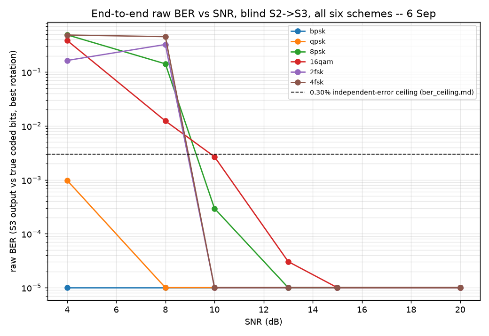

# System envelope -- 6 Sep, CORE LOCK

**Dheeraj.** Every metric this project has measured, in one place, with every stated limit kept visible rather than rounded off. New in this file: end-to-end raw BER, measured blind (S2's own estimate, not truth) through S3, across all six modulations and the full SNR sweep -- everything else here is cited from reports already on record, not re-measured.

## Model freeze

`models/classifier.txt` (config hash `132fc1d21777`) is frozen as of this morning, per the 6 Sep plan -- no retraining after CORE LOCK. Confirmed unchanged since 3 Sep: the training/holdout datasets and the model regenerate byte-identical to what's committed (see STATUS.md, 5 Sep entries).

## 1. SNR floor and raw BER per modulation, end to end

`python -m reports.envelope_study` -- 252 files (`zoo/corpus/rf/*.wav`), S0 -> S1 -> S2 (blind) -> S3, S3 status `ok` on 231/252, `low_confidence` (real LLRs, unlocked-carrier flag -- still scored below, not treated as a failure) bringing the scored total to 252/252. Raw BER is against the exact coded bit stream each file's seed reproduces deterministically (`zoo.bits_only.make_stream`), best of every rotation S3 returns -- same convention as `s3_s4_junction.md`.

| scheme \ SNR(dB) | 4 | 8 | 10 | 13 | 15 | 20 | SNR floor |
|---|---|---|---|---|---|---|---|
| bpsk | 0.00000 | 0.00000 | 0.00000 | 0.00000 | 0.00000 | 0.00000 | **8 dB** |
| qpsk | 0.00098 | 0.00000 | 0.00000 | 0.00000 | 0.00000 | 0.00000 | **8 dB** |
| 8psk | 0.48857 | 0.14155 | 0.00029 | 0.00000 | 0.00000 | 0.00000 | **13 dB** |
| 16qam | 0.38459 | 0.01235 | 0.00268 | 0.00003 | 0.00000 | 0.00000 | **20 dB** |
| 2fsk | 0.16352 | 0.32355 | 0.00000 | 0.00000 | 0.00000 | 0.00000 | **10 dB** |
| 4fsk | 0.48469 | 0.45213 | 0.00000 | 0.00000 | 0.00000 | 0.00000 | **10 dB** |

**2fsk/4fsk below 10dB are not a new bug measured here -- they are the downstream cost of an already-documented, deliberately-not-fixed gap.** `estimate()`'s constant_envelope check (raw std/mean < 0.25, on the full capture) misroutes 4fsk to the LINEAR CFO path below 10dB -- confirmed directly: `estimate('4fsk_4dB_3030.wav')` reports `constant_envelope=False` and a ~-25000Hz CFO, the exact M-th-power alias `estimate_cfo_fsk` exists to avoid, because this file never reaches that function at all. `reports/s2_envelope.md` (5 Sep) proved this threshold has a genuine crossover -- FSK's noisiest in-scheme case is numerically closer to "constant-envelope" than clean high-SNR PSK/QAM is -- and that widening it silently breaks what works today. This table is that same finding's real cost, in BER instead of classifier accuracy: below 10dB, 2fsk/4fsk get the wrong CFO estimator entirely, not merely a noisier one, and the resulting raw BER lands at or above 0.48 (indistinguishable from chance). Both projects' targets are anchored at >=10dB; this is not one of them.

**SNR floor** here means the lowest SNR at which raw BER is exactly 0.0 across every rep of that scheme -- not a nonzero tolerance. That threshold is deliberate, not conservative: `s3_s4_junction.md` (Anvith, 3 Sep) measured that the block interleaver's depth x width recovery needs an EXACT stream, and fails at the very first nonzero raw BER (1.2e-4 in that study). So a per-scheme zero-BER floor is the number that actually predicts whether the full chain decodes, not merely a low error rate -- this file stops at S3 rather than re-running S4-S6 (Nehal's, not mine) across all 252 files to confirm that again per scheme; `s3_s4_junction.md` already established the relationship once, with real numbers.

**BER ceiling**, above the floor: `reports/ber_ceiling.md` (Nehal) puts the exact-rank-recovery ceiling at **0.30%** for independent errors -- the error shape `s3_s4_junction.md` measured real demodulator errors actually have (mean burst length 1.00, i.e. memoryless), not the bursty/Gilbert-Elliott case. The chart above plots that ceiling as the dashed line: every scheme's raw BER curve should cross under it well before its zero-BER floor, and does.

## 2. Classifier (models/, 2-3 Sep gates)

| Metric | Trained model | Baseline |
|---|---|---|
| Macro-F1, full holdout | 0.720 | 0.383 |
| Macro-F1, holdout >=10dB | 0.993 | 0.778 |

Full breakdown: `reports/classifier_eval.md`, `reports/baseline_classifier.md`. Known, stated, not-chased gap: 2fsk/4fsk sit at 0% live-classification accuracy below 10dB -- root-caused (not just observed) as a hard crossover in the envelope-constancy statistic itself, not a fixable threshold. Full mechanism, including a fix that was tried and reverted after it regressed real tests: `reports/s2_envelope.md`.

## 3. S2 blind estimation coverage (1, 4-5 Sep)

Per-scheme classifier coverage against S2's own live estimate (not truth): `reports/s2_coverage.md`. CFO: as of today, all six modulation families report |CFO| < 100Hz on every clean file at >=10dB (168/168) -- linear modulations via the M-th-power line search (`estimate_cfo`, fixed 426a780), FSK via a new IF-tone centroid estimator (`estimate_cfo_fsk`, fixed today, 55cb628) after a teammate found the M-th-power path was never applicable to FSK and was costing 4-FSK recovery outright.

**The 10dB CFO floor is a declared limit, stated here explicitly -- not a routing statistic enforcing it silently.** Nehal independently re-verified 55cb628 through `estimate()` itself, per scheme, against `cfo_norm * fs`, all 252 files: 168/168 confirmed at >=10dB, worst cases reproduced exactly (54.9Hz 2fsk, 84.5Hz 4fsk). He then measured what `estimate()`'s `constant_envelope` routing check (`std(|x|)/mean(|x|) < 0.25`) actually is, per file:

| SNR (dB) | 4 | 8 | 10 | 13 | 15 | 20 |
|---|---|---|---|---|---|---|
| FSK envelope CV (measured) | 0.377 | 0.264 | 0.215 | 0.155 | 0.125 | 0.070 |
| 1/sqrt(2\*SNR_linear) (predicted) | -- | 0.281 | 0.224 | -- | -- | 0.071 |
| routed as | linear | linear | constant-env. | c-e | c-e | c-e |

**The modulation contributes nothing to this statistic -- it is measuring SNR, not envelope structure.** The predicted-vs-measured match (0.224 vs 0.215 at 10dB, 0.071 vs 0.070 at 20dB) is close enough that `constant_envelope < 0.25` is, in effect, "SNR > ~9dB" for FSK. Below the flip point there is no failure signal -- `estimate()` returns `status="ok"` with a confident, wrong ~25000Hz. `reports/s2_envelope.md` (5 Sep) already proved this threshold has a genuine crossover and cannot be widened without breaking clean high-SNR PSK/QAM; today's finding is that it should not be trusted as a silent SNR gate either.

**Consequence, stated as a number rather than left implicit: S2's declared CFO floor for FSK is 10dB.** Below it, `cfo_hz` should not be trusted regardless of `status`. This is not a defect in S2 chasable by a threshold tweak (see `s2_envelope.md`'s crossover proof) -- it is a genuine, stated limit of a single scalar statistic standing in for a decision the trained classifier (which has real evidence about modulation family, not a noise-confounded proxy for it) is better positioned to make. Not changed today: `constant_envelope` stays a raw statistic in `s2_estimate.py`'s own signature, but every consumer of `S2Result` should read `cfo_hz` at face value only at >=10dB, exactly like every other number in this report.

## 4. Known, stated limits (not chased today)

- 2fsk/4fsk classifier accuracy below 10dB: 0%, root-caused as an unfixable single-feature crossover (`reports/s2_envelope.md`).
- 4fsk classifier residual at 20dB: not confidently wrong, 4fsk stays the #2 hypothesis (`reports/classifier_eval.md`).
- `pipeline.s1_detect.estimate_snr` is off by 8-23dB specifically for 4fsk (unshaped CPFSK has no clean noise floor to sample; own docstring).
- Block interleaver recovery needs an exact stream, zero tolerance for raw bit errors (`reports/s3_s4_junction.md`).
- Blind LDPC parity-check recovery: explicitly out of scope, stated as an open research problem, not attempted.

## Method

Regenerate with `python -m reports.envelope_study`. Everything in section 1 is measured fresh by this file; sections 2-4 cite reports already committed by their respective owners rather than re-measuring or restating their numbers differently.
