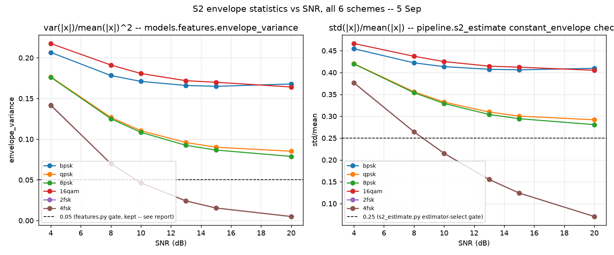

# S2 envelope statistics vs SNR -- 5 Sep

Both panels plot the same underlying quantity (envelope spread relative to its mean) computed two different ways in this codebase, against SNR, averaged per scheme over all corpus reps. Left: `models.features.envelope_variance` (var/mean^2), gates the IF-histogram peak-finder in the classifier feature extractor. Right: the raw `std/mean` ratio `pipeline.s2_estimate.estimate()` computes on the full capture to pick which symbol-rate estimator to run.

## Why the 0-8dB gap exists

Both statistics are dominated by additive-noise-induced envelope spread at low SNR: for a genuinely constant-envelope signal (2fsk/4fsk, unshaped CPFSK), that spread is close to the *entire* signal, so it falls steeply and predictably with SNR. For RRC-shaped PSK/QAM, pulse-shaping itself contributes most of the spread, so the SNR-dependent term is a smaller fraction of a much higher floor. Both fixed thresholds (0.05 and 0.25) were implicitly calibrated at the point where the two curves are cleanly separated, which is >=10dB -- matching every other gate in this project.

## Why both gates stay fixed (not adaptive, not removed)

Measured on this corpus: FSK's noisiest in-scheme case (2fsk/4fsk at 4dB) reaches std/mean=0.377, while clean PSK/QAM's best case (any of bpsk/qpsk/8psk/16qam at 20dB) sits as low as 0.281 -- **FSK-at-4dB is numerically closer to constant-envelope than clean-20dB-PSK/QAM is**, by this single scalar metric. No fixed threshold on this statistic can classify both correctly, in either direction: raising it enough to catch low-SNR FSK necessarily starts misclassifying clean high-SNR PSK/QAM, which today works perfectly (see s2_coverage.md); removing it entirely (tried on the `models.features` copy of this gate, see module docstring) is the same trade in the limit -- measured to regress a deterministic 15dB test and a previously-solid 4fsk classification. An SNR-adaptive threshold was considered and rejected too: pipeline.s1_detect.estimate_snr is itself off by 8-23dB specifically for 4fsk (see its own docstring), so adaptively thresholding the exact class most affected on a broken SNR estimate would trade one gap for a worse one, one day before CORE LOCK. Left as a known, quantified, low-SNR-only gap -- consistent with every gate in this project being anchored at >=10dB.

## What was tried this session

Removed `models.features.if_histogram_features`'s `envelope_variance(x) >= 0.05` gate (which clamps `peak_count` to 1 rather than running the peak-finder) on the theory that envelope_variance is already its own feature, so the trained classifier could learn the right cutoff contextually instead of a fixed one. Ungated, real corpus windows at 8dB peak-count separably (2fsk~2, 4fsk~5, PSK/QAM~1) and the retrained holdout macro-F1 barely moved (0.720->0.722 overall). But re-running the full targeted test suite caught what the aggregate holdout number hid: `test_if_hist_peak_count_matches_scheme` started failing at 15dB for qpsk/8psk/16qam (spurious peaks, exactly what the original gate's docstring warned about), `test_baseline_macro_f1_on_training_set` dropped below its regression floor, and a previously-solid 4fsk-at-15dB classification flipped to 2fsk. Reverted; models/features.py's docstring documents the attempt and the measured reason it didn't survive testing, same as the 4fsk overfitting misdiagnosis correction in classifier_eval.md -- a disproven hypothesis, kept visible rather than silently dropped.
